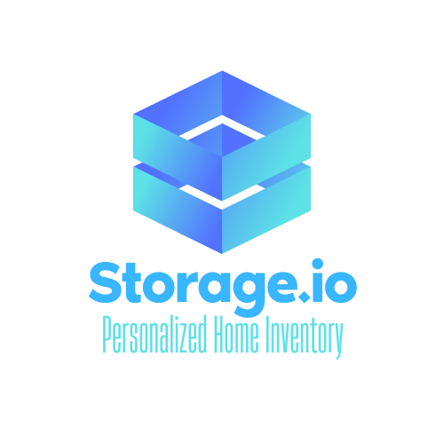

# Storage.io

# Your Personalized Home Inventory

  

<strong>Purpose of the app:</strong> Storage.io brings better organization to packing, moving and storing your belongings. You can use our application for any area in your life that needs more organization but here are a few examples:
<ul>
<li>
 if you are moving houses, use Storage.io to label each box or container, then add all of the items within that container and we will store those items in our database.
 </li>
 <li>Going on a road trip? Let's get your suitcase in order. Add everything in your suitcase to your account and make sure you're not forgetting any essential items!</li>
 <li>Create an inventory of all the loose items hidden away in the attic, storage unit, or basement. Instead of tearing everything apart, just check where you have it located in your dashboard.</li>
 </ul>

<!-- AUTHORS-->

## Site was Built By:

<a href="https://github.com/mendo94">Rina Mendoza</a>

<a href="https://github.com/vollmetal">Sarah Avins</a>

<a href="https://github.com/iamAlitkhan">Ali Khan</a>

<!-- SITE PREVIEW -->

## Site Preview

<!-- Web Demo -->

## Web Demo

<!-- ACKNOWLEDGMENTS -->

## Acknowledgments

Project could not have been made without the help of:

- [Bootstrap Cheat Sheet](https://hackerthemes.com/bootstrap-cheatsheet/)
- [Font Awesome](https://fontawesome.com)

(<a href="#top">back to top</a>)

